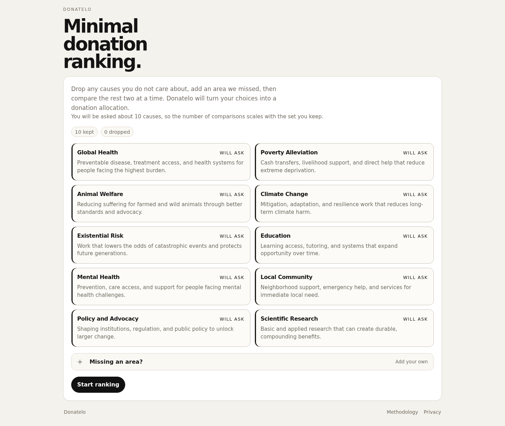

# Donatelo

Donatelo is a small, self-hostable web app that helps people decide how to split a donation across cause areas.

Instead of asking users to assign percentages from scratch, it presents two causes at a time. The resulting pairwise preferences are converted into a 100% allocation that can be adjusted, reviewed, and shared.

**Live site:** [donatelo.robmcelhinney.com](https://donatelo.robmcelhinney.com)



## Features

- Rank cause areas through simple pairwise comparisons
- Mark two causes as equally important or skip a comparison
- Add, edit, and remove custom cause areas
- Adjust the final allocation from more balanced to more decisive
- Edit or remove earlier answers and replay the ranking history
- Share a saved session or export the result as an image
- Continue comparing causes after the initial result
- Delete a saved session from the server
- Follow an external effective-giving guide for organisation recommendations

Donatelo does not recommend individual charities itself. Its result represents the user's preferences between broad cause areas; it is not an assessment of objective need or charity effectiveness.

## How it works

Each choice updates the two causes using an Elo-style rating. An equal choice is recorded as a draw, while a skipped comparison does not affect the ratings or progress.

The ratings are converted into positive weights and normalised to total 100%. An allocation-style control blends that result with an even split, allowing the user to make the final allocation flatter or sharper. See the in-app methodology page for more detail.

## Tech stack

- React 18
- Vite 5
- Node.js HTTP server
- JSON-backed session storage

The Node server provides the API, persists sessions, and serves the Vite build in production. No database or third-party service is required.

## Local development

Requirements: a current Node.js LTS release and npm.

```bash
git clone https://github.com/robmcelhinney/donatelo.git
cd donatelo
npm ci
npm run dev
```

Open [http://localhost:3000](http://localhost:3000).

Session data is written to `.donatelo/sessions.json`, which is excluded from Git.

## Docker Compose

Build and start the production app:

```bash
docker compose up -d --build
```

The included Compose file publishes the app at `http://localhost:3003`. Change the left side of the port mapping if another host port is required:

```yaml
ports:
    - "3003:3000"
```

Sessions are stored in the `donatelo-data` named volume and survive container replacement. To inspect the service:

```bash
docker compose ps
docker compose logs -f donatelo
curl http://localhost:3003/api/health
```

For a public deployment, place the container behind a TLS-terminating reverse proxy such as Nginx or Caddy. Only the reverse proxy needs to be exposed to the internet.

## Privacy and data

A session contains a random identifier, selected and custom causes, comparison answers, ratings, allocation settings, and timestamps. Donatelo does not ask for a name, email address, or payment details, and the application contains no analytics or advertising trackers.

Sessions are stored on the server until deleted. Anyone with a session URL can view its answers and results, so shared links should be treated as private. This repository's JSON store is suitable for a small single-instance deployment; larger or multi-instance deployments should replace it with a transactional data store and define an explicit retention policy.

## Contributing

Issues and pull requests are welcome.

## Licence

Donatelo is available under the [MIT License](LICENSE).
